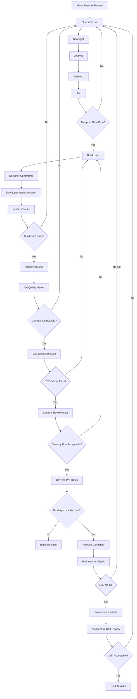

# AI-SDR (Software Development Runtime)

[](https://github.com/boraeresici/AI-SDR)
[](https://github.com/boraeresici/AI-SDR/tree/main)
[](skill-spec/SKILL_SPEC_v1.0.md)
[](skills)
[](https://www.w3.org/WAI/WCAG21/quickref/)
[](skills/qa-quality-gates/SKILL.md)

AI-SDR (Software Development Runtime), vibe coding hizini korurken SDD (Software Design Document) disiplinini zorunlu kilan skill tabanli bir runtime yaklasimidir. Sistem, rol bazli skill'leri orchestrate ederek fikirden canliya gecisi kontrol eder.

## Proje Amaci

- Faz gecislerini kontrol etmek: `Blueprint -> Build -> Hardening`
- Mimari, scope, UX, kalite, operasyon ve ROI kararlarini gate modeliyle kilitlemek
- "Hizli kod + dusuk borc + olculebilir cikti" dengesini standardize etmek

## Skill Ekosistemi

- `skills/loop-master-orchestrator/SKILL.md`
- `skills/architect-decision-matrix/SKILL.md`
- `skills/pm-context-scope/SKILL.md`
- `skills/ux-design-system/SKILL.md`
- `skills/fullstack-implementation-refactor/SKILL.md`
- `skills/qa-quality-gates/SKILL.md`
- `skills/devops-deployment-stability/SKILL.md`
- `skills/roi-investor-check/SKILL.md`
- `skills/contract-compat-check/SKILL.md`
- `skills/e2e-execution-gate/SKILL.md`
- `skills/security-review-gate/SKILL.md`
- `skills/architecture-drift-review/SKILL.md`

## Canonical Standartlar

- Skill format standardi: `skill-spec/SKILL_SPEC_v1.0.md`
- Refactor plani: `skill-spec/SKILL_REFACTOR_PLAN_v1.md`
- Surec diyagrami: `process.mmd`

## Cleanup Sonrasi Repo Yapisi

```text
.
├── README.md
├── process.mmd
├── skill-spec
│   ├── SKILL_SPEC_v1.0.md
│   └── SKILL_REFACTOR_PLAN_v1.md
└── skills
    ├── architect-decision-matrix/
    ├── architecture-drift-review/
    ├── contract-compat-check/
    ├── devops-deployment-stability/
    ├── e2e-execution-gate/
    ├── fullstack-implementation-refactor/
    ├── loop-master-orchestrator/
    ├── pm-context-scope/
    ├── qa-quality-gates/
    ├── roi-investor-check/
    ├── security-review-gate/
    └── ux-design-system/
```

## Process (Ozet)

1. Blueprint Loop:
   - Strategist, Analyst, Architect, PM tarafindan immutable kontratlar uretilir.
2. Build Loop:
   - Designer + Developer implement eder, No-Go ihlallerinde loop durur.
3. Hardening Loop:
   - QA sonrasi Contract Check, E2E Gate ve Security Gate zorunlu calisir.
   - Contract fail ise Blueprint'e, E2E/Security fail ise Build'e geri donulur.
   - DevOps pre-check tamamlanmadan prod onayi istenmez.
4. ROI Gate:
   - Teknik cikti is sonucuna baglanir, go/no-go karari verilir.
5. Runtime Drift Gate:
   - Production sonrasi architecture drift kontrol edilir; sapma varsa yeniden Blueprint fazina donulur.
6. Trigger Mapping:
   - `agent-map.yaml` benzeri routing dis dosyada degil, `loop-master-orchestrator` icine gomulu source-of-truth olarak tutulur.

## Process Diagram (GitHub Render)



## Mermaid Usage

Mermaid diyagramlarini markdown dosyalarinda fenced code block ile olustur:


Alternatif olarak `:::` bloklari da kullanilabilir:

::: mermaid
graph TD;
    A-->B;
    A-->C;
    B-->D;
    C-->D;
:::

Iconify ikonlari desteklenir:

```mermaid
architecture-beta
    service user(mdi:account)
    service lambda(logos:aws-lambda)

    user:R --> L:lambda
```



Not: GitHub icin en guvenli format fenced ` ```mermaid ` bloktur.

## Mermaid Navigation ve Configuration

VS Code Markdown Mermaid eklentisi ile:
- Zoom: `+/-`, `Alt+Scroll`, `Pinch`, `Alt+Click`
- Pan: `Alt+Drag` veya pan mode
- Resize: diyagram alt kenarini surukleyerek

Onemli ayarlar:
- `markdown-mermaid.lightModeTheme`
- `markdown-mermaid.darkModeTheme`
- `markdown-mermaid.languages`
- `markdown-mermaid.mouseNavigation.enabled` (`always|alt|never`)
- `markdown-mermaid.controls.show` (`never|onHoverOrFocus|always`)
- `markdown-mermaid.resizable`
- `markdown-mermaid.maxHeight`
- `markdown-mermaid.maxTextSize`

## Kritik Karar Kurallari

- Build'e gecis icin minimum artefakt: API Contract + DoD + Auth Scheme + Data Schema
- PM onceliklendirme: MoSCoW (Must <= %60)
- UX: WCAG 2.1 AA + breakpoints `375/768/1024/1440`
- Fullstack No-Go: `any`, type hint eksigi, business logic layer ihlali, N+1
- QA Gate: Critical path %100, genel coverage >= %70, lint 0
- Contract Gate: FE/BE contract uyumsuzlugu `0`
- E2E Gate: Critical senaryolarda fail `0`
- Security Gate: yuksek/kritik acik varken release bloklanir
- DevOps: Staging auto; Production migration manuel user onayi + SQL diff
- ROI: `Technical Debt Ratio = refactor_effort / new_feature_effort`

## Referans URL'ler

- Proje reposu: https://github.com/boraeresici/AI-SDR
- OpenAPI: https://www.openapis.org/
- JSON Schema: https://json-schema.org/
- Mermaid: https://mermaid.js.org/
- WCAG 2.1 AA: https://www.w3.org/WAI/WCAG21/quickref/
- MoSCoW Prioritization: https://www.productplan.com/glossary/moscow-prioritization/

## Kullanım Notu

Yeni skill eklerken veya mevcut skill guncellerken `skill-spec/SKILL_SPEC_v1.0.md` section contract'larina birebir uy.
