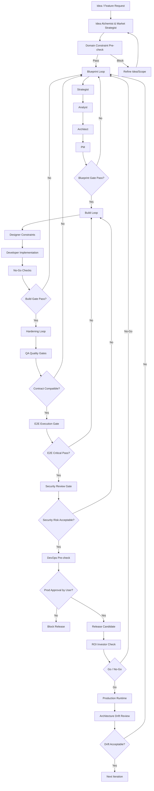

# AI-SDR Process Diagram

```mermaid
flowchart TD
    A[Idea / Feature Request] --> A0[Idea Alchemist & Market Strategist]
    A0 --> A1[Domain Constraint Pre-check]
    A1 -->|Pass| B[Blueprint Loop]
    A1 -->|Block| A2[Refine Idea/Scope]
    A2 --> A0
    B --> B1[Strategist]
    B1 --> B2[Analyst]
    B2 --> B3[Architect]
    B3 --> B4[PM]
    B4 --> C{Blueprint Gate Pass?}

    C -- No --> B
    C -- Yes --> D[Build Loop]

    D --> D1[Designer Constraints]
    D1 --> D2[Developer Implementation]
    D2 --> D3[No-Go Checks]
    D3 --> E{Build Gate Pass?}

    E -- No --> B
    E -- Yes --> F[Hardening Loop]

    F --> F1[QA Quality Gates]
    F1 --> F1A{Contract Compatible?}
    F1A -- No --> B
    F1A -- Yes --> F1B[E2E Execution Gate]
    F1B --> F1C{E2E Critical Pass?}
    F1C -- No --> D
    F1C -- Yes --> F1D[Security Review Gate]
    F1D --> F1E{Security Risk Acceptable?}
    F1E -- No --> D
    F1E -- Yes --> F2[DevOps Pre-check]
    F2 --> G{Prod Approval by User?}

    G -- No --> H[Block Release]
    G -- Yes --> I[Release Candidate]

    I --> J[ROI Investor Check]
    J --> K{Go / No-Go}
    K -- No-Go --> B
    K -- Go --> L[Production Runtime]
    L --> M[Architecture Drift Review]
    M --> N{Drift Acceptable?}
    N -- No --> B
    N -- Yes --> O[Next Iteration]
```
